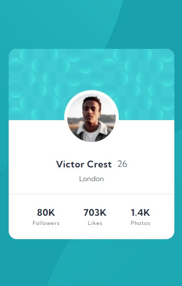

# Frontend Mentor - Profile card component solution

This is a solution to the [Profile card component challenge on Frontend Mentor](https://www.frontendmentor.io/challenges/profile-card-component-cfArpWshJ).

## Table of contents

- [Screenshot](#screenshot)
- [My process](#my-process)
  - [Built with](#built-with)
  - [What I learned](#what-i-learned)

## Screenshot

## My process

### Built with

- Semantic HTML5 markup
- CSS custom properties
- Flexbox
- Mobile-first workflow

### What I learned
- This assignment helped me with my git skills.
- Messed up the layout when trying to refactor some CSS so I was able to checkout an older git commit, create and work on a new branch, and then merge it back into the main branch.
- Spent a longer time than expected working on the absolute positioning of the svg background images to keep them aligned with the card.